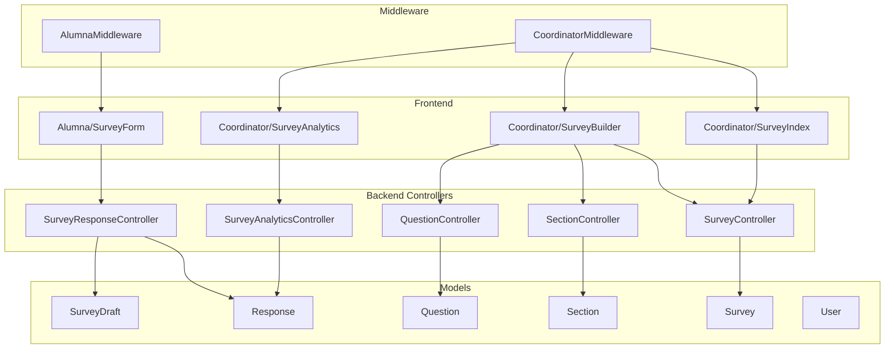

# Design Document: Survey Management

## Overview

The Survey Management feature replaces the existing static JSON-driven questionnaire system with a fully dynamic, database-driven survey platform. Coordinators can create surveys composed of ordered Sections and Questions, activate them for alumni, and view aggregated analytics. Alumni navigate surveys one section at a time with server-side draft persistence so progress is never lost.

The old `survey_categories`, `survey_submissions`, and `survey_answers` tables — and the hardcoded `questions.json` file — are dropped entirely. The new schema introduces five clean tables: `surveys`, `sections`, `questions`, `responses`, and `survey_drafts`.

The stack is Laravel 11 (backend) + React/Inertia.js (frontend) with shadcn/ui components. Role-based access is enforced via the existing `user_role` column (`alumna` | `coordinator`) and the `isAlumna()` / `isCoordinator()` helpers on the `User` model.

---

## Architecture



**Request flow:**
1. All requests pass through Laravel's `auth` middleware first.
2. Role-specific middleware (`coordinator` or `alumna`) gates each route group.
3. Controllers load Eloquent models and return Inertia responses with props.
4. React pages receive typed props and render UI; mutations go back via Inertia `router.post/put/delete`.

---

## Components and Interfaces

### Middleware

**`App\Http\Middleware\EnsureCoordinator`**
- Checks `Auth::user()->isCoordinator()`, aborts with 403 if false.

**`App\Http\Middleware\EnsureAlumna`**
- Checks `Auth::user()->isAlumna()`, aborts with 403 if false.

Both are registered as named aliases in `bootstrap/app.php` (`coordinator`, `alumna`).

---

### Policies

**`SurveyPolicy`** — model-level authorization for `Survey` records

| Method | Signature | Logic |
|--------|-----------|-------|
| `viewAny` | `viewAny(User)` | Returns `true` if `$user->isCoordinator()` |
| `view` | `view(User, Survey)` | Coordinator can always view; alumna can only view if `$survey->status === 'active'` |
| `create` | `create(User)` | Returns `true` if `$user->isCoordinator()` |
| `update` | `update(User, Survey)` | Returns `true` if `$user->isCoordinator()` |
| `delete` | `delete(User, Survey)` | Returns `true` if `$user->isCoordinator()` AND `$survey->responses()->exists()` is `false` |
| `activate` | `activate(User, Survey)` | Returns `true` if `$user->isCoordinator()` AND `$survey->sections()->exists()` is `true` |
| `submit` | `submit(User, Survey)` | Returns `true` if `$user->isAlumna()` AND `$survey->status === 'active'` AND no existing `Response` records for this user+survey |

**`SurveyDraftPolicy`** — model-level authorization for `SurveyDraft` records

| Method | Signature | Logic |
|--------|-----------|-------|
| `view` | `view(User, SurveyDraft)` | Returns `true` if `$draft->user_id === $user->id` |
| `update` | `update(User, SurveyDraft)` | Returns `true` if `$draft->user_id === $user->id` |

Both policies are discovered automatically via Laravel's policy auto-discovery (model class name convention). No manual registration in `AuthServiceProvider` is required.

---

### Controllers

Each controller action calls `$this->authorize()` using the appropriate policy method instead of performing inline role checks. For example:
- `SurveyController::destroy()` calls `$this->authorize('delete', $survey)`
- `SurveyResponseController::submit()` calls `$this->authorize('submit', $survey)`
- `SurveyResponseController::show()` calls `$this->authorize('view', $survey)`

**`SurveyController`** — Coordinator survey CRUD
| Method | Route | Description |
|--------|-------|-------------|
| `index()` | GET `/coordinator/surveys` | List all surveys with section count |
| `store(Request)` | POST `/coordinator/surveys` | Create survey (status defaults to inactive) |
| `update(Request, Survey)` | PUT `/coordinator/surveys/{survey}` | Update title/description/status |
| `destroy(Survey)` | DELETE `/coordinator/surveys/{survey}` | Soft-delete; blocked if responses exist |

**`SectionController`** — Section CRUD within a survey
| Method | Route | Description |
|--------|-------|-------------|
| `store(Request, Survey)` | POST `/coordinator/surveys/{survey}/sections` | Add section, append display_order |
| `update(Request, Section)` | PUT `/coordinator/sections/{section}` | Rename section |
| `reorder(Request, Survey)` | PUT `/coordinator/surveys/{survey}/sections/reorder` | Bulk update display_order |
| `destroy(Section)` | DELETE `/coordinator/sections/{section}` | Delete if no questions; resequence |

**`QuestionController`** — Question CRUD within a section
| Method | Route | Description |
|--------|-------|-------------|
| `store(Request, Section)` | POST `/coordinator/sections/{section}/questions` | Add question; auto-generate slug |
| `update(Request, Question)` | PUT `/coordinator/questions/{question}` | Update label/type/options/required |
| `reorder(Request, Section)` | PUT `/coordinator/sections/{section}/questions/reorder` | Bulk update display_order |
| `move(Request, Question)` | PUT `/coordinator/questions/{question}/move` | Move to different section |
| `destroy(Question)` | DELETE `/coordinator/questions/{question}` | Delete question |

**`SurveyResponseController`** — Alumna survey interaction
| Method | Route | Description |
|--------|-------|-------------|
| `index()` | GET `/alumna/surveys` | List active surveys; mark completed ones |
| `show(Survey)` | GET `/alumna/surveys/{survey}` | Load survey + draft state |
| `saveSection(Request, Survey)` | POST `/alumna/surveys/{survey}/draft` | Upsert draft for current section |
| `submit(Request, Survey)` | POST `/alumna/surveys/{survey}/submit` | Promote draft to responses; delete draft |

**`SurveyAnalyticsController`** — Coordinator analytics
| Method | Route | Description |
|--------|-------|-------------|
| `show(Survey, Request)` | GET `/coordinator/surveys/{survey}/analytics` | Aggregated data; supports `?section_id=`, `?from=`, `?to=` |

---

### React Pages

**`Coordinator/SurveyIndex`**
- Props: `surveys[]` (id, title, status, created_at, sections_count)
- Lists surveys in a shadcn `Table`; status badge; links to builder and analytics
- Create survey via inline form or modal using shadcn `Dialog`

**`Coordinator/SurveyBuilder`**
- Props: `survey`, `sections[]` (each with nested `questions[]`)
- Left panel: section list with drag-handle for reorder (or up/down buttons)
- Right panel: question list for selected section; inline add/edit/delete
- Question form fields: label, type selector, options (shown for select/radio/checkbox), is_required toggle
- Uses Inertia `router.put/post/delete` for all mutations; no full page reload

**`Coordinator/SurveyAnalytics`**
- Props: `survey`, `sections[]`, `analytics` (per-question aggregated data), `totalRespondents`, `sectionSummary[]`
- Section filter dropdown; date range pickers
- Charts rendered with a lightweight library (Recharts — already common in React ecosystems)
- Bar chart per question showing answer distribution; section summary table

**`Alumna/SurveyForm`**
- Props: `survey`, `sections[]` (with questions), `currentSectionIndex`, `draft` (answers JSON)
- Step indicator: "Step N of T"
- Renders only the current section's questions
- Question renderers by type: text input, textarea, number input, select, radio group, checkbox group
- "Next" / "Submit" button depending on position; "Back" button for previous sections (client-side only, no re-save)
- On Next: `router.post('/alumna/surveys/{id}/draft', { section_id, answers })`
- On Submit: `router.post('/alumna/surveys/{id}/submit', { section_id, answers })`

---

### Form Requests

All mutating controller actions are injected with a dedicated Form Request class. Laravel resolves and validates these before the controller method runs; on failure it automatically returns HTTP 422 and Inertia surfaces the errors as `$page.props.errors`.

---

**`StoreSurveyRequest`**
```php
public function rules(): array
{
    return [
        'title'       => ['required', 'string', 'max:255'],
        'description' => ['nullable', 'string'],
        'status'      => ['sometimes', 'in:active,inactive'],
    ];
}
```

---

**`UpdateSurveyRequest`**

Same rules as `StoreSurveyRequest` but every field is optional (uses `sometimes` on all).
```php
public function rules(): array
{
    return [
        'title'       => ['sometimes', 'string', 'max:255'],
        'description' => ['nullable', 'string'],
        'status'      => ['sometimes', 'in:active,inactive'],
    ];
}
```

---

**`StoreSectionRequest`**
```php
public function rules(): array
{
    $surveyId = $this->route('survey')->id;

    return [
        'title' => [
            'required',
            'string',
            'max:255',
            Rule::unique('sections')->where('survey_id', $surveyId),
        ],
    ];
}
```

---

**`StoreQuestionRequest`**
```php
public function rules(): array
{
    $choiceTypes = ['select', 'radio', 'checkbox'];

    return [
        'label'         => ['required', 'string', 'max:255'],
        'type'          => ['required', 'in:text,select,radio,checkbox,number,textarea'],
        'is_required'   => ['sometimes', 'boolean'],
        'display_order' => ['sometimes', 'integer', 'min:1'],
        'options'       => [
            Rule::requiredIf(in_array($this->input('type'), $choiceTypes)),
            'array',
            'min:1',
        ],
        'options.*'     => ['string', 'max:255'],
    ];
}
```

---

**`UpdateQuestionRequest`**

Same rules as `StoreQuestionRequest` but all fields are optional; the conditional `options` rule still applies when `type` is present and is a choice type.
```php
public function rules(): array
{
    $choiceTypes = ['select', 'radio', 'checkbox'];
    $type = $this->input('type');

    return [
        'label'         => ['sometimes', 'string', 'max:255'],
        'type'          => ['sometimes', 'in:text,select,radio,checkbox,number,textarea'],
        'is_required'   => ['sometimes', 'boolean'],
        'display_order' => ['sometimes', 'integer', 'min:1'],
        'options'       => [
            Rule::requiredIf($type && in_array($type, $choiceTypes)),
            'sometimes',
            'array',
            'min:1',
        ],
        'options.*'     => ['sometimes', 'string', 'max:255'],
    ];
}
```

---

**`SaveSectionDraftRequest`**

Dynamically builds validation rules at runtime by loading the current section's questions from the database. Answers are submitted as `answers[{question_id}]`.

```php
public function rules(): array
{
    $section = $this->route('survey')
        ->sections()
        ->with('questions')
        ->findOrFail($this->input('section_id'));

    $rules = [];

    foreach ($section->questions as $question) {
        $key = "answers.{$question->id}";
        $presence = $question->is_required ? 'required' : 'nullable';

        $rules[$key] = match ($question->type) {
            'text', 'textarea' => [$presence, 'string', 'max:1000'],
            'number'           => [$presence, 'numeric'],
            'select', 'radio'  => [$presence, 'string', 'in:' . implode(',', $question->options ?? [])],
            'checkbox'         => [$presence, 'array', 'min:1'],
            default            => [$presence],
        };
    }

    return $rules;
}
```

---

**`SubmitSurveyRequest`**

Uses the same dynamic rule-building logic as `SaveSectionDraftRequest` but applies to the final section submission. The rules are identical; the distinction is semantic (draft vs. final commit) and is enforced at the controller level.

```php
// Same rules() implementation as SaveSectionDraftRequest
```

---

## Data Models

### Database Schema

#### Migration order (new migrations to create)

1. Drop old tables: `survey_answers`, `survey_submissions`, `survey_categories`
2. Create `surveys`
3. Create `sections`
4. Create `questions`
5. Create `responses`
6. Create `survey_drafts`

#### `surveys`
```sql
id              BIGINT UNSIGNED AUTO_INCREMENT PRIMARY KEY
title           VARCHAR(255) NOT NULL
description     TEXT NULL
status          ENUM('active','inactive') NOT NULL DEFAULT 'inactive'
created_at      TIMESTAMP
updated_at      TIMESTAMP
deleted_at      TIMESTAMP NULL  -- soft deletes
```

#### `sections`
```sql
id              BIGINT UNSIGNED AUTO_INCREMENT PRIMARY KEY
survey_id       BIGINT UNSIGNED NOT NULL  FK → surveys.id CASCADE DELETE
title           VARCHAR(255) NOT NULL
display_order   UNSIGNED INT NOT NULL
created_at      TIMESTAMP
updated_at      TIMESTAMP
UNIQUE(survey_id, title)
```

#### `questions`
```sql
id                    BIGINT UNSIGNED AUTO_INCREMENT PRIMARY KEY
section_id            BIGINT UNSIGNED NOT NULL  FK → sections.id CASCADE DELETE
question_identifier   VARCHAR(255) NOT NULL  -- unique slug scoped to survey
label                 VARCHAR(255) NOT NULL
type                  ENUM('text','select','radio','checkbox','number','textarea') NOT NULL
options               JSON NULL
display_order         UNSIGNED INT NOT NULL
is_required           BOOLEAN NOT NULL DEFAULT FALSE
created_at            TIMESTAMP
updated_at            TIMESTAMP
UNIQUE(section_id, label)
-- question_identifier uniqueness is enforced at application level scoped to survey_id
```

#### `responses`
```sql
id              BIGINT UNSIGNED AUTO_INCREMENT PRIMARY KEY
survey_id       BIGINT UNSIGNED NOT NULL  FK → surveys.id
user_id         BIGINT UNSIGNED NOT NULL  FK → users.id
question_id     BIGINT UNSIGNED NOT NULL  FK → questions.id
answer_value    TEXT NULL
submitted_at    TIMESTAMP NOT NULL
created_at      TIMESTAMP
updated_at      TIMESTAMP
INDEX(survey_id, user_id)
INDEX(question_id)
```

#### `survey_drafts`
```sql
id              BIGINT UNSIGNED AUTO_INCREMENT PRIMARY KEY
user_id         BIGINT UNSIGNED NOT NULL  FK → users.id
survey_id       BIGINT UNSIGNED NOT NULL  FK → surveys.id
answers         JSON NOT NULL  -- { question_id: answer_value, ... }
last_section_id BIGINT UNSIGNED NOT NULL  FK → sections.id
updated_at      TIMESTAMP
UNIQUE(user_id, survey_id)
```

---

### Eloquent Models

**`Survey`**
```php
// Relationships
public function sections(): HasMany          // sections ordered by display_order
public function responses(): HasMany
public function drafts(): HasMany

// Scopes
public function scopeActive($query)          // where status = 'active'

// Attributes
protected $casts = ['deleted_at' => 'datetime'];
use SoftDeletes;
```

**`Section`**
```php
public function survey(): BelongsTo
public function questions(): HasMany         // ordered by display_order
public function responses(): HasManyThrough  // through questions
```

**`Question`**
```php
public function section(): BelongsTo
public function responses(): HasMany
protected $casts = ['options' => 'array', 'is_required' => 'boolean'];
```

**`Response`**
```php
public function survey(): BelongsTo
public function user(): BelongsTo
public function question(): BelongsTo
```

**`SurveyDraft`**
```php
public function user(): BelongsTo
public function survey(): BelongsTo
public function lastSection(): BelongsTo     // FK last_section_id → sections
protected $casts = ['answers' => 'array'];
```

---

### `question_identifier` Slug Generation

When a question is created, the backend generates a slug from the label using `Str::slug($label)`. Before persisting, it checks for uniqueness scoped to the parent survey (via the section's `survey_id`). If a collision exists, a numeric suffix is appended (`-2`, `-3`, etc.) until unique. This logic lives in `QuestionController::store()` and is also applied on label updates.

```php
// Pseudocode
$base = Str::slug($request->label);
$slug = $base;
$i = 2;
while (
    Question::whereHas('section', fn($q) => $q->where('survey_id', $section->survey_id))
            ->where('question_identifier', $slug)
            ->exists()
) {
    $slug = $base . '-' . $i++;
}
```

---

### Analytics Query Design

The `SurveyAnalyticsController::show()` method builds aggregated data in a single query pass:

```php
// Aggregated counts per question per answer_value (excludes text/textarea)
Response::where('survey_id', $survey->id)
    ->whereHas('question', fn($q) => $q->whereNotIn('type', ['text', 'textarea']))
    ->when($sectionId, fn($q) => $q->whereHas('question', fn($q2) =>
        $q2->where('section_id', $sectionId)))
    ->when($from, fn($q) => $q->where('submitted_at', '>=', $from))
    ->when($to,   fn($q) => $q->where('submitted_at', '<=', $to))
    ->select('question_id', 'answer_value', DB::raw('COUNT(*) as count'))
    ->groupBy('question_id', 'answer_value')
    ->with('question.section')
    ->get();
```

The result is transformed into the frontend-consumable format:
```json
{
  "totalRespondents": 42,
  "sectionSummary": [
    { "section_id": 1, "title": "Personal Info", "response_count": 42 }
  ],
  "questions": [
    {
      "question_id": 5,
      "label": "Employment Status",
      "section_id": 1,
      "section_title": "Personal Info",
      "data": [
        { "label": "Employed", "value": 30 },
        { "label": "Unemployed", "value": 12 }
      ]
    }
  ]
}
```

---

### Route Structure

```php
// coordinator routes — auth + coordinator middleware
Route::prefix('coordinator')->name('coordinator.')->middleware(['auth', 'coordinator'])->group(function () {
    // Survey CRUD
    Route::get('/surveys', [SurveyController::class, 'index'])->name('surveys.index');
    Route::post('/surveys', [SurveyController::class, 'store'])->name('surveys.store');
    Route::put('/surveys/{survey}', [SurveyController::class, 'update'])->name('surveys.update');
    Route::delete('/surveys/{survey}', [SurveyController::class, 'destroy'])->name('surveys.destroy');

    // Survey Builder (Inertia page)
    Route::get('/surveys/{survey}/builder', [SurveyController::class, 'builder'])->name('surveys.builder');

    // Analytics
    Route::get('/surveys/{survey}/analytics', [SurveyAnalyticsController::class, 'show'])->name('surveys.analytics');

    // Sections
    Route::post('/surveys/{survey}/sections', [SectionController::class, 'store'])->name('sections.store');
    Route::put('/surveys/{survey}/sections/reorder', [SectionController::class, 'reorder'])->name('sections.reorder');
    Route::put('/sections/{section}', [SectionController::class, 'update'])->name('sections.update');
    Route::delete('/sections/{section}', [SectionController::class, 'destroy'])->name('sections.destroy');

    // Questions
    Route::post('/sections/{section}/questions', [QuestionController::class, 'store'])->name('questions.store');
    Route::put('/sections/{section}/questions/reorder', [QuestionController::class, 'reorder'])->name('questions.reorder');
    Route::put('/questions/{question}', [QuestionController::class, 'update'])->name('questions.update');
    Route::put('/questions/{question}/move', [QuestionController::class, 'move'])->name('questions.move');
    Route::delete('/questions/{question}', [QuestionController::class, 'destroy'])->name('questions.destroy');
});

// alumna routes — auth + alumna middleware
Route::prefix('alumna')->name('alumna.')->middleware(['auth', 'alumna'])->group(function () {
    Route::get('/surveys', [SurveyResponseController::class, 'index'])->name('surveys.index');
    Route::get('/surveys/{survey}', [SurveyResponseController::class, 'show'])->name('surveys.show');
    Route::post('/surveys/{survey}/draft', [SurveyResponseController::class, 'saveSection'])->name('surveys.draft');
    Route::post('/surveys/{survey}/submit', [SurveyResponseController::class, 'submit'])->name('surveys.submit');
});
```

---

## Correctness Properties

*A property is a characteristic or behavior that should hold true across all valid executions of a system — essentially, a formal statement about what the system should do. Properties serve as the bridge between human-readable specifications and machine-verifiable correctness guarantees.*

---

### Property 1: Survey creation round-trip

*For any* valid survey payload (non-empty title), creating a survey and then fetching it should return a record with the submitted title, the submitted description, and a status of `inactive`.

**Validates: Requirements 1.2**

---

### Property 2: Survey update persistence

*For any* existing survey and any valid update payload (title, description, or status), after the update call the stored record should reflect exactly the submitted values.

**Validates: Requirements 1.3**

---

### Property 3: Soft-delete excludes survey from normal queries

*For any* survey, after a soft-delete request, the survey should not appear in the coordinator's survey list but should still be retrievable via `withTrashed()`.

**Validates: Requirements 1.4**

---

### Property 4: Empty title is rejected

*For any* string that is empty or composed entirely of whitespace, submitting it as a survey title should return a validation error on the `title` field and leave the survey count unchanged.

**Validates: Requirements 1.5**

---

### Property 5: Surveys with responses cannot be deleted

*For any* survey that has one or more Response records, a delete request should return an error and the survey should remain in the database.

**Validates: Requirements 1.6**

---

### Property 6: Section display_order invariant

*For any* survey, after any sequence of section additions, deletions, or reorders, the remaining sections should have contiguous `display_order` values starting from 1 with no gaps or duplicates.

**Validates: Requirements 2.1, 2.3, 2.4**

---

### Property 7: Section rename preserves questions and responses

*For any* section rename, the question count and response count for that section should be identical before and after the rename.

**Validates: Requirements 2.2**

---

### Property 8: Section with questions cannot be deleted

*For any* section that contains one or more questions, a delete request should return a validation error and the section should remain in the database.

**Validates: Requirements 2.5**

---

### Property 9: Duplicate section title within survey is rejected

*For any* survey that already has a section with title T, attempting to create another section with the same title T in the same survey should return a validation error.

**Validates: Requirements 2.6**

---

### Property 10: Question creation round-trip

*For any* valid question payload (label, type, options where required, section_id), creating a question and then fetching it should return a record with all submitted fields intact and a generated `question_identifier`.

**Validates: Requirements 3.1**

---

### Property 11: Question update preserves responses

*For any* question update (label or type change), the count of Response records linked to that question should be identical before and after the update.

**Validates: Requirements 3.2**

---

### Property 12: Question display_order invariant

*For any* section, after any sequence of question additions, deletions, reorders, or moves, the remaining questions in each section should have contiguous `display_order` values starting from 1 with no gaps or duplicates.

**Validates: Requirements 3.3, 3.4**

---

### Property 13: Choice questions require at least one option

*For any* question with type `select`, `radio`, or `checkbox` submitted with an empty or absent options array, the creation request should return a validation error.

**Validates: Requirements 3.5**

---

### Property 14: Duplicate question label within section is rejected

*For any* section that already has a question with label L, attempting to create another question with the same label L in the same section should return a validation error.

**Validates: Requirements 3.6**

---

### Property 15: question_identifier is unique per survey

*For any* two questions in the same survey, their `question_identifier` values should be distinct. When a collision would occur, the system should append a numeric suffix to ensure uniqueness.

**Validates: Requirements 3.7**

---

### Property 16: Survey visibility matches status

*For any* survey, if its status is `active` it should appear in the alumna survey list; if its status is `inactive` it should not appear in the alumna survey list. Toggling status should immediately change visibility.

**Validates: Requirements 4.1, 4.2, 5.1**

---

### Property 17: Activation requires at least one section

*For any* survey with zero sections, a request to set its status to `active` should return a validation error and the status should remain `inactive`.

**Validates: Requirements 4.4, 2.7**

---

### Property 18: Draft upsert round-trip

*For any* alumna and any active survey, after calling the draft-save endpoint with a set of answers and a `last_section_id`, loading the survey should return those same answers pre-populated and the form positioned at the saved section. Calling the endpoint again with new answers should update (not duplicate) the draft record.

**Validates: Requirements 5.5, 5.6, 8.1, 8.3, 8.7**

---

### Property 19: Submission promotes all draft answers to responses and deletes draft

*For any* alumna with a complete Survey_Draft, after a successful submit call, a Response record should exist for every question in the draft's answers, each with the correct `survey_id`, `user_id`, `question_id`, `answer_value`, and a non-null `submitted_at`; and the Survey_Draft record should no longer exist.

**Validates: Requirements 5.8, 8.5**

---

### Property 20: Required questions block section advancement

*For any* section that contains at least one question with `is_required = true`, submitting that section with a missing or empty answer for that question should return a validation error and not save the draft.

**Validates: Requirements 5.9**

---

### Property 21: Completed survey is not resubmittable

*For any* alumna who has existing Response records for a survey, the survey show endpoint should return a `completed` flag and the submit endpoint should reject further submissions.

**Validates: Requirements 5.10**

---

### Property 22: Analytics aggregation correctness

*For any* survey with responses, the analytics endpoint should return: (a) a `totalRespondents` value equal to the count of distinct `user_id` values in the responses table for that survey; (b) per-question data where the sum of all `value` entries for a question equals the total response count for that question; (c) no entries for `text` or `textarea` question types.

**Validates: Requirements 6.1, 6.2, 6.8**

---

### Property 23: Section filter scopes analytics to that section's questions

*For any* analytics request filtered by `section_id`, all returned question entries should belong to questions whose `section_id` matches the filter.

**Validates: Requirements 6.3**

---

### Property 24: Date range filter scopes analytics to submitted_at window

*For any* analytics request filtered by a date range `[from, to]`, all underlying Response records contributing to the aggregation should have `submitted_at >= from` and `submitted_at <= to`.

**Validates: Requirements 6.5**

---

### Property 25: Role enforcement — cross-role access returns 403

*For any* authenticated alumna user, any request to a coordinator survey management route should return HTTP 403. *For any* authenticated coordinator user, any request to an alumna survey submission route should return HTTP 403.

**Validates: Requirements 7.1, 7.2**

---

### Property 26: Unauthenticated requests are redirected to login

*For any* unauthenticated request to any survey route (coordinator or alumna), the response should be a redirect to the appropriate login page.

**Validates: Requirements 7.4**

---

### Property 27: Draft is preserved on submission failure

*For any* alumna with a Survey_Draft, if the transaction that promotes answers to Response records fails (e.g., DB error), the Survey_Draft record should still exist with its original answers intact.

**Validates: Requirements 8.6**

---

## Error Handling

### Validation Errors
All mutating routes use dedicated Form Request classes (see Form Requests section). Laravel resolves and validates the request before the controller runs; on failure it automatically returns HTTP 422 without the controller ever executing. Inertia surfaces the error bag as `$page.props.errors` on the frontend and shadcn `FormMessage` components display field-level errors inline.

### Authorization Errors
- Both middleware (route-level) and policies (model-level) return HTTP 403 on unauthorized access. Middleware gates entire route groups by role; policies enforce finer-grained per-model rules within those groups.
- Policies are registered via Laravel's automatic policy discovery — no manual `Gate::policy()` calls are needed as long as the policy class names follow the `{Model}Policy` convention.
- 403 responses from either source are caught by Inertia's error handling and can render a dedicated error page.
- Unauthenticated requests redirect to the appropriate login route (alumna or coordinator) based on the route prefix.

### Business Rule Errors
Violations of business rules (delete survey with responses, delete section with questions, activate survey with no sections) are returned as validation errors with a descriptive message on a synthetic field (e.g., `'survey' => 'Cannot delete a survey that has responses.'`). This keeps the error format consistent with field validation errors on the frontend.

### Draft Promotion Failure
The `submit` action wraps the draft-to-responses promotion in a `DB::transaction()`. If any insert fails, the transaction rolls back, the draft is preserved, and a 500 response with a user-friendly error message is returned to the frontend.

### Soft Delete Cascade
When a survey is soft-deleted, associated sections and questions are not physically deleted — they remain in the database linked to the soft-deleted survey. They are excluded from all normal queries because they are only reachable through the soft-deleted survey. Hard deletion (if ever needed) would cascade via FK constraints.

---

## Testing Strategy

### Dual Testing Approach

Both unit/feature tests and property-based tests are required. They are complementary:
- Feature tests (Laravel's `TestCase` + `RefreshDatabase`) cover specific examples, integration points, and error conditions.
- Property-based tests verify universal properties across many generated inputs.

### Feature Tests (PHPUnit / Laravel Feature Tests)

Focus areas:
- Each controller action: happy path + validation error + authorization error
- Draft upsert idempotency (call twice, assert one record)
- Submission transaction rollback (mock DB failure, assert draft preserved)
- Analytics endpoint response shape
- Middleware: alumna hitting coordinator routes returns 403, and vice versa

Example test structure:
```php
// SurveyControllerTest
public function test_coordinator_can_create_survey(): void
public function test_empty_title_returns_validation_error(): void
public function test_survey_with_responses_cannot_be_deleted(): void
public function test_alumna_cannot_access_coordinator_routes(): void
```

### Property-Based Tests (PHP — using `eris/eris` or `giorgiosironi/eris`)

Each correctness property from the design document maps to exactly one property-based test. Tests are tagged with a comment referencing the property.

**Tag format:** `// Feature: survey-management, Property {N}: {property_text}`

Minimum 100 iterations per property test.

Example:
```php
// Feature: survey-management, Property 4: Empty title is rejected
public function test_empty_title_always_rejected(): void
{
    $this->forAll(
        Generator\elements(['', '   ', "\t", "\n"])
    )->then(function (string $title) {
        $response = $this->actingAs($this->coordinator)
            ->post('/coordinator/surveys', ['title' => $title]);
        $response->assertSessionHasErrors('title');
    });
}
```

```php
// Feature: survey-management, Property 6: Section display_order invariant
public function test_section_display_order_is_always_contiguous(): void
{
    $this->forAll(
        Generator\choose(1, 10)  // random number of sections to add
    )->then(function (int $count) {
        $survey = Survey::factory()->create();
        for ($i = 0; $i < $count; $i++) {
            $this->actingAs($this->coordinator)
                ->post("/coordinator/surveys/{$survey->id}/sections", ['title' => "Section $i"]);
        }
        $orders = $survey->sections()->orderBy('display_order')->pluck('display_order')->toArray();
        $this->assertEquals(range(1, $count), $orders);
    });
}
```

```php
// Feature: survey-management, Property 18: Draft upsert round-trip
public function test_draft_upsert_is_idempotent(): void
{
    $this->forAll(
        Generator\associative([
            'question_id' => Generator\choose(1, 100),
            'answer'      => Generator\printableAsciiString(),
        ])
    )->then(function (array $answers) {
        // Call draft save twice with same user+survey
        // Assert only one draft record exists with latest answers
    });
}
```

### Property Test Coverage Map

| Property | Test Method |
|----------|-------------|
| 1 — Survey creation round-trip | `test_survey_creation_round_trip` |
| 2 — Survey update persistence | `test_survey_update_persists_values` |
| 3 — Soft-delete excludes from list | `test_soft_deleted_survey_excluded` |
| 4 — Empty title rejected | `test_empty_title_always_rejected` |
| 5 — Surveys with responses not deletable | `test_survey_with_responses_not_deletable` |
| 6 — Section display_order invariant | `test_section_display_order_is_always_contiguous` |
| 7 — Section rename preserves questions | `test_section_rename_preserves_questions` |
| 8 — Section with questions not deletable | `test_section_with_questions_not_deletable` |
| 9 — Duplicate section title rejected | `test_duplicate_section_title_rejected` |
| 10 — Question creation round-trip | `test_question_creation_round_trip` |
| 11 — Question update preserves responses | `test_question_update_preserves_responses` |
| 12 — Question display_order invariant | `test_question_display_order_is_always_contiguous` |
| 13 — Choice questions require options | `test_choice_question_requires_options` |
| 14 — Duplicate question label rejected | `test_duplicate_question_label_rejected` |
| 15 — question_identifier unique per survey | `test_question_identifier_unique_per_survey` |
| 16 — Survey visibility matches status | `test_survey_visibility_matches_status` |
| 17 — Activation requires sections | `test_activation_requires_at_least_one_section` |
| 18 — Draft upsert round-trip | `test_draft_upsert_round_trip` |
| 19 — Submission promotes draft to responses | `test_submission_promotes_draft_to_responses` |
| 20 — Required questions block advancement | `test_required_questions_block_section_advancement` |
| 21 — Completed survey not resubmittable | `test_completed_survey_not_resubmittable` |
| 22 — Analytics aggregation correctness | `test_analytics_aggregation_correctness` |
| 23 — Section filter scopes analytics | `test_section_filter_scopes_analytics` |
| 24 — Date range filter scopes analytics | `test_date_range_filter_scopes_analytics` |
| 25 — Cross-role access returns 403 | `test_cross_role_access_returns_403` |
| 26 — Unauthenticated redirected to login | `test_unauthenticated_redirected_to_login` |
| 27 — Draft preserved on failure | `test_draft_preserved_on_submission_failure` |
